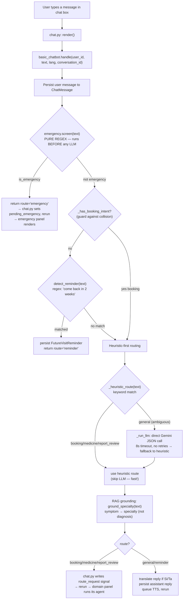
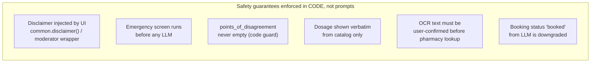
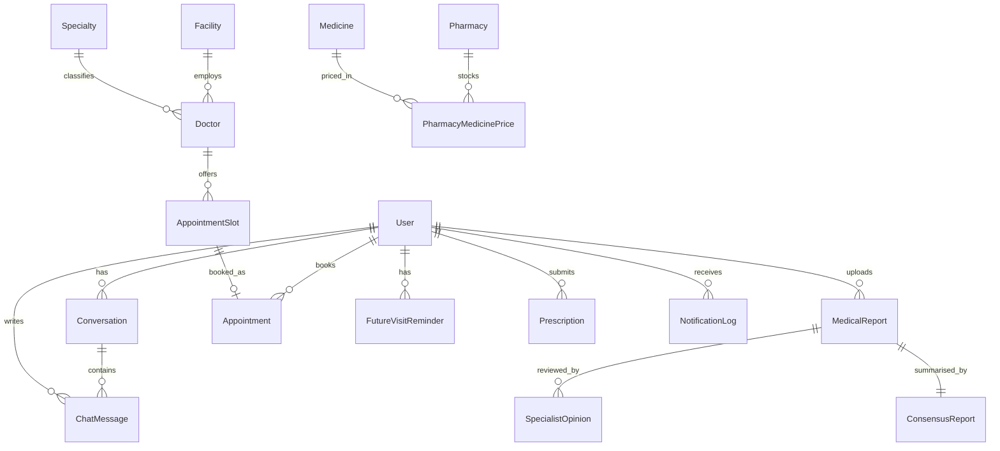
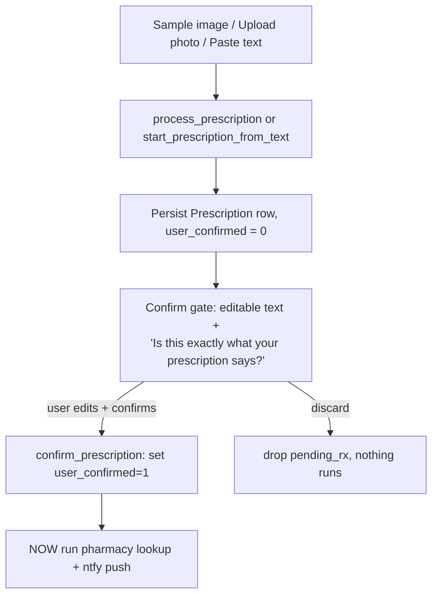

# MedBridge AI — Technical Defense / Viva Preparation Guide

**Project:** MedBridge AI — Multi-agent healthcare navigator for Sri Lanka
**Event:** AgenTrix 2026 · Team **Dream_4** (TEAM18)
**Repo:** `AGENTRIX26-TEAM18-Dream_4`
**Members:** Chanupa · Thevindu · Nisal · Janidu
**Purpose of this document:** prepare all four members to defend the code, design and architecture in front of industry experts.

> ⚠️ This guide lives **outside** the Git repository (in your `Documents` folder). Nothing here is committed to the project. It is study material only.

---

## How to use this guide

1. **Everyone reads Part 1 (Shared Foundation) and Part 2 (Folder Structure).** These are the questions any examiner can throw at *any* member: "What is this project? Why these tools? What happens when a message is sent?"
2. **Each member owns one section of Part 3.** You must be able to walk through your files line-by-line, explain *why* a decision was made, and answer the "likely questions" listed under your section.
3. **Part 4 is the cross-cutting Q&A bank** — the "gotcha" questions and the documentation-vs-code drift you should know about before an examiner finds it.
4. **Part 5 is the live demo script.**

A diagram convention note: diagrams are written in **Mermaid** (renders in VS Code with the *Markdown Preview Mermaid* extension and on GitHub) plus ASCII where it's clearer. If Mermaid doesn't render in your viewer, read the ASCII version beside it.

---
---

# PART 1 — SHARED FOUNDATION (every member must know this cold)

## 1.1 What is MedBridge AI? (the 30-second pitch)

MedBridge AI is a **Streamlit web app** that acts as a *healthcare navigator* — not a doctor. A patient logs in and chats in plain English, Sinhala or Tamil. Behind the chat box sits a **team of specialised AI agents** that:

- **Triage symptoms** → suggest *which kind of doctor* to see (never a diagnosis).
- **Screen for emergencies** → instantly, before any AI runs, with a tap-to-call `1990` ambulance link + a push alert to the patient's family.
- **Book appointments** → resolve a doctor/specialty, find slots, offer nearby alternatives when full, and book atomically.
- **Compare medicine prices** → across pharmacies, sorted by cost and distance.
- **Run a "specialist panel"** → three independent AI specialists read the same medical report and a moderator surfaces their agreements *and disagreements*.
- **Transcribe prescriptions** → from a photo (OCR), but only after the user confirms the text.

**The single most important framing sentence for the viva:**
> "MedBridge AI never produces a medical diagnosis. It is a *navigation and logistics* tool that degrades gracefully — every AI feature has a deterministic fallback, so the app is fully demoable even with no API key and no internet."

## 1.2 The problem it solves

Patients in Sri Lanka (especially elderly, rural, or non-English speakers) struggle to: know which specialist to see, find and book appointments, compare medicine prices, and get a second opinion on a report. MedBridge bundles these into one trilingual conversational interface, built entirely on **free-tier** services.

## 1.3 The hard constraints (memorise these — examiners love them)

These were competition rules the team deliberately honoured. Each one is a *design decision you can defend*:

| Constraint | How it's honoured in code | Why it matters |
|---|---|---|
| **Free-tier only** | Gemini free tier; ntfy.sh free topics; local ONNX embeddings (no embedding API cost); gTTS (no key). | No billing, reproducible by judges. |
| **Never diagnose** | The disclaimer is rendered by the **UI layer** (`common.disclaimer()`), never by the LLM — a malformed generation cannot drop it. Agents map symptoms to a *specialty*, never a disease. | Safety + medico-legal. |
| **No plaintext passwords** | `bcrypt` hashes everything, including seed users (hashed by the loader on insert). | Security baseline. |
| **No real data** | Every seed JSON carries `"_note": "SEED DATA — not live"`, echoed in logs and the UI banner. | Honesty; no fake clinical claims. |
| **Real orchestration, no n8n/Zapier** | CrewAI (specialist panel + moderator) and Pydantic AI (booking) are real Python. | Shows genuine engineering. |
| **Emergency dialling** | Rendered as a `tel:1990` link → opens the device dialer. No paid telephony. | Free + works on real phones. |
| **Never invent dosage** | Medicine tracker only displays `reference_dosage_text` from the seed catalog. | Patient safety. |
| **RAG offline-safe** | `retrieve()` returns `[]` and never raises when the index is missing; every agent has a deterministic fallback. | Robustness. |

## 1.4 Technology stack (and *why* each was chosen)

```mermaid
flowchart TB
    subgraph Presentation
      ST["Streamlit 1.31+<br/>(web UI, session_state)"]
    end
    subgraph Orchestration / Agents
      CW["CrewAI<br/>specialist panel + moderator"]
      PA["Pydantic AI<br/>typed booking agent"]
      GEN["google-generativeai<br/>direct Gemini calls<br/>(chat router, OCR, STT, translate)"]
    end
    subgraph Knowledge
      CH["ChromaDB<br/>vector store (RAG)"]
      EMB["Local ONNX MiniLM<br/>(default embeddings)"]
    end
    subgraph Data
      SQL["SQLite<br/>17 tables"]
    end
    subgraph External (free tier)
      GM["Google Gemini API<br/>gemini-2.5-flash"]
      NT["ntfy.sh<br/>push notifications"]
      TTS["gTTS<br/>text-to-speech"]
    end
    ST --> CW & PA & GEN
    CW & PA & GEN --> GM
    CW & PA & GEN --> CH
    CH --> EMB
    ST --> SQL
    ST --> NT
    ST --> TTS
```

| Tech | Role | Why this one |
|---|---|---|
| **Streamlit** | Entire UI; reruns top-to-bottom on every interaction; `st.session_state` holds per-session state. | Fastest way to a working multi-page app in a 12-hour hackathon; pure Python, no JS. |
| **Google Gemini `gemini-2.5-flash`** | LLM brain: chat routing, specialist opinions, moderation, OCR (Vision), speech-to-text, translation. | Generous free tier; multimodal (text + image + audio) from one model. |
| **CrewAI** | Multi-agent framework for the specialist panel (3 agents) and the moderator. | Gives the "panel of experts" the *agent/role/task/crew* abstraction the brief asked for. |
| **Pydantic AI** | The booking agent — LLM with **typed tool calls** and a **typed output** (`BookingResponse`). | Guarantees the model's output validates against a schema; tools wrap real SQL. |
| **ChromaDB + ONNX MiniLM** | Local vector search (RAG) for symptom→specialty, doctor/facility, medicine-name grounding. | Runs offline, no key, no quota; keeps the index consistent regardless of API key. |
| **SQLite** | All persistence (17 tables). | Zero-config single file; perfect for a demo; ACID transactions for atomic booking. |
| **bcrypt (passlib/bcrypt)** | Password hashing. | Industry-standard slow hash. |
| **ntfy.sh** | Push notifications (emergency, booking, report, prescription, reminders). | Free, no signup; family subscribes to a topic URL. |
| **gTTS** | Voice output of replies. | Free, no API key. |
| **Pydantic v2** | All data models / schemas across the app (`models.py`). | Validation + typed contracts between layers. |

## 1.5 High-level architecture (the layered view)

```
┌────────────────────────────────────────────────────────────────┐
│  STREAMLIT UI  (project/ui/)                                     │
│  app.py  →  thin shell, bootstraps, calls each panel.render()    │
│  panels/  →  sidebar · chat · emergency · booking · medicine ·   │
│              report · prescription · history                     │
│  Panels talk to each other ONLY via st.session_state signals     │
│  (the "route_request" pattern).                                  │
└───────────────────────────┬────────────────────────────────────┘
                            │  route_request / pending_* signals
┌───────────────────────────▼────────────────────────────────────┐
│  AGENT LAYER  (project/agents/)                                  │
│  basic_chatbot  (router + memory + reminder detect)             │
│  emergency      (pure regex, no LLM, no network)                │
│  booking_agent  (Pydantic AI + deterministic SQL fallback)      │
│  medicine_tracker (fuzzy + RAG matching, OCR confirm gate)      │
│  specialist_panel (3 parallel independent CrewAI agents)        │
│  moderator      (consensus + disagreement guard)                │
│  reminders      (due-window + ntfy push)                        │
│  vision_ocr     (Gemini Vision)                                 │
└───────────┬───────────────────────────────┬────────────────────┘
            │                               │
┌───────────▼─────────────┐   ┌─────────────▼──────────────────────┐
│  RAG LAYER (project/rag) │   │  SUPPORT SERVICES                  │
│  retriever.retrieve()    │   │  i18n/   (translate, tts, stt)     │
│  embeddings (ONNX/Gemini)│   │  notifications/ (ntfy_client)      │
│  ingest (build index)    │   │  models.py (Pydantic schemas)      │
│  ChromaDB store          │   └────────────────────────────────────┘
└───────────┬─────────────┘
            │
┌───────────▼─────────────────────────────────────────────────────┐
│  DATA LAYER  (project/db/)                                       │
│  db.py (connection + init + migrate) · schema.sql (17 tables)    │
│  seed.py (idempotent seed loader) · app.db (SQLite file)         │
│  kb/  (seed JSON + RAG knowledge + sample reports/prescriptions) │
└──────────────────────────────────────────────────────────────────┘
```

**Three design principles that define the whole system** (be ready to name these):

1. **Thin shell, fat panels.** `app.py` does *nothing* but bootstrap and call `render()` on each panel. All UI logic is in `project/ui/panels/`. This is what let four people work in parallel without merge hell — each panel is one file with one owner.
2. **Decoupled routing via `route_request`.** Only `chat.py` talks to the chatbot. When intent is detected it writes a one-shot `st.session_state["route_request"]` signal and reruns; each domain panel picks up *its own* route. So `chat.py` imports **zero** domain agents.
3. **Graceful degradation everywhere.** Every LLM/network call has a deterministic fallback. No API key → heuristic router, stub opinions, English passthrough, empty RAG. The demo *cannot* hard-fail.

## 1.6 The end-to-end request lifecycle (THE diagram to memorise)

This is the single most important flow. An examiner will almost certainly ask "walk me through what happens when a user types a message."



**Key teaching points in this flow:**
- **Emergency screening is first and synchronous** — no network latency on the safety path.
- **Reminder detection is skipped if booking intent is present** — "book me in 2 weeks" must go to *booking*, not *reminders*. (This is the collision fix.)
- **Routing is heuristic-first** — unambiguous intents (booking/medicine/report verbs) never call the LLM. Only the genuinely ambiguous "general" bucket spends an LLM call. This removed a multi-second hang and guarantees the chat never blocks on a rate-limited key.

## 1.7 The safety model (a recurring viva theme)



The theme: **"We don't trust the LLM to be safe — we make safety structural."** A wonky generation cannot omit the disclaimer, cannot hallucinate a confirmed booking, cannot silently smooth disagreement into false agreement, and cannot run a pharmacy lookup on unconfirmed OCR text.

## 1.8 The data model (17 SQLite tables)



| Table | Purpose |
|---|---|
| `User` | Accounts: bcrypt hash, preferred language, family contact. |
| `Conversation` | A chat **thread** (ChatGPT-style). *(README calls this "ChatSession" — see drift note 1.11.)* |
| `ChatMessage` | One chat turn, linked to a conversation. |
| `MedicalReport` | Uploaded/pasted report text. |
| `SpecialistOpinion` | One row per specialist per report. |
| `ConsensusReport` | Moderator synthesis (summary + agreement/disagreement JSON). |
| `Specialty`, `Facility`, `Doctor` | Doctor catalog (specialty + facility + fee). |
| `AppointmentSlot`, `Appointment` | Slots and confirmed bookings (`slot_id` UNIQUE → no double-book). |
| `FutureVisitReminder` | Reminder rows with target date/month + `notified` flag. |
| `Prescription` | OCR'd/pasted text + `user_confirmed` flag. |
| `Medicine`, `Pharmacy`, `PharmacyMedicinePrice` | Medicine catalog + per-pharmacy prices/stock. |
| `NotificationLog` | Audit log of every ntfy push attempt. |

**Connection design (`db.py`):** one SQLite file `project/db/app.db`; connections are **thread-local** (`threading.local()`) because Streamlit reruns on one thread per session but background callbacks may differ. `PRAGMA foreign_keys = ON`, `row_factory = sqlite3.Row` (dict-like rows), `check_same_thread=False`. `init_db()` is idempotent (`CREATE TABLE IF NOT EXISTS`) and runs `_migrate()` for older DBs (adds `conversation_id` column, folds orphan messages into one thread).

## 1.9 The `session_state` + `route_request` decoupling pattern (architecture highlight)

This is the cleverest structural idea in the codebase — worth being able to explain by *any* member.

**Problem:** Streamlit reruns the whole script on every click. If every panel imported every agent, you'd get a giant tangled `app.py` and four people editing the same file.

**Solution — the panel contract** (documented in `panels/__init__.py`):
- Every panel exposes exactly `def render(user: dict) -> None`. It draws to the page and reads/writes `st.session_state`. It never returns data upward.
- `chat.py` is the *only* panel that calls `basic_chatbot.handle`. When intent routes to a domain, it writes a **one-shot signal**:
  ```python
  st.session_state["route_request"] = {
      "route": "booking" | "medicine" | "report_review",
      "extracted": {...},   # structured fields from the router
      "raw_text": "<user message>",
  }
  st.rerun()
  ```
- On the next rerun, each domain panel checks for *its* route at the top of `render()`, runs its own agent, fills its `pending_*` state, and pops `route_request`.

**Payoff:** `chat.py` imports no domain agents. Booking logic lives only in Thevindu's files, medicine only in Nisal's, report only in Chanupa's. Clean ownership = parallel work.

## 1.10 Glossary (terms an examiner may quiz you on)

- **RAG (Retrieval-Augmented Generation):** retrieve relevant curated text from a vector DB and use it to *ground* the model so it doesn't free-associate. Here it grounds symptom→specialty, doctor lookup, medicine names.
- **Embedding:** a vector (list of floats) representing the meaning of text. Similar meanings → nearby vectors. We use **cosine similarity**; `score = max(0, 1 − cosine_distance)`.
- **ONNX MiniLM:** the small local embedding model ChromaDB bundles (`DefaultEmbeddingFunction`), runs via `onnxruntime`, ~80 MB, downloaded once, fully offline.
- **CrewAI:** framework structuring LLMs as *Agents* (role/goal/backstory) running *Tasks* inside a *Crew*.
- **Pydantic AI:** an agent framework where the LLM's output is validated against a Pydantic model and its tools are typed Python functions.
- **bcrypt:** deliberately slow password hash with per-password salt; resistant to brute force.
- **Haversine:** great-circle distance between two lat/long points on a sphere — used to rank pharmacies by distance.
- **Idempotent:** running it twice has the same effect as once (seed loader, RAG ingest, reminder firing).
- **Atomic transaction:** all-or-nothing DB write — booking inserts the appointment *and* flips the slot in one `with conn:` block.
- **`st.session_state`:** Streamlit's per-user-session dictionary that survives reruns (but not a hard browser refresh — hence the `?uid=` URL trick).

## 1.11 Known documentation-vs-code drift (KNOW THESE before an examiner finds them)

Hackathon docs drifted from the final code. Being upfront about this shows mastery:

1. **`models/` folder vs `models.py`.** The main README's "Project Structure" shows a `project/models/` *package* (common.py, booking.py, chat.py…). **Reality: it's a single file `project/models.py`** holding all Pydantic models. (`pyproject.toml` even has a stale per-file ignore for `project/models/__init__.py`.) If asked: "We consolidated the models into one module; the README structure section wasn't updated."
2. **`ChatSession` vs `Conversation`.** README's table says `ChatSession`; the actual table is `Conversation`. Same concept, renamed.
3. **Gemini model default.** `project/README.md` mentions `gemini-1.5-flash`; **the code defaults to `gemini-2.5-flash`** (see every agent's `_GEMINI_MODEL` and `.env.example`).
4. **"CrewAI orchestrator" for chat.** The chatbot docstring says a "single CrewAI Task" classifies intent, but the implementation was **replaced by a direct Gemini JSON call + heuristic-first routing** (see `_run_llm`'s docstring explaining why: CrewAI added ~5s and retried 429s into 30–60s hangs). CrewAI is still genuinely used for the **specialist panel and moderator**.
5. **Missing referenced files.** README references `docs/BOOKING_AGENT_DESIGN.md` and `OWNERS.md`; only `docs/rag.md` is actually tracked.
6. **Embedding model name.** Code comments mention `text-embedding-004` was retired; the Gemini path now uses `models/gemini-embedding-001`. Default remains **local ONNX**, so this only matters if `RAG_EMBED_BACKEND=gemini`.

---
---

# PART 2 — FOLDER STRUCTURE (annotated)

```
AGENTRIX26-TEAM18-Dream_4/
├── Readme.md                     # Top-level project README (full feature list)
├── pyproject.toml                # Build + ruff (lint) + black (format) + pytest config
├── requirements.txt              # (root) runtime deps
├── requirements-dev.txt          # dev/CI deps (pytest, ruff, black)
├── .streamlit/config.toml        # Streamlit theme/config
├── docs/
│   └── rag.md                    # RAG subsystem technical reference
│
├── tests/                        # 40 offline tests (no API key needed)
│   ├── conftest.py               # fixtures: seeded_db, chroma_tmp, no_api_key
│   ├── test_auth.py              # signup/login/bcrypt
│   ├── test_booking.py           # parsing, alternatives, atomic book, agent build
│   ├── test_chatbot.py           # heuristic routing, emergency-before-LLM
│   ├── test_emergency.py         # regex true-positives / clean-negatives
│   ├── test_i18n.py              # catalog completeness, offline passthrough
│   ├── test_jsonutil.py          # balanced-JSON extraction
│   ├── test_medicine.py          # exact/fuzzy/RAG match, haversine
│   ├── test_notifications.py     # ntfy logging on success/failure
│   ├── test_rag.py               # grounding, offline-safety, idempotent ingest
│   └── test_reminders.py         # detection, due-window, idempotent fire
│
└── project/
    ├── __init__.py
    ├── README.md                 # Tiered scope README (Tier 1/2/3)
    ├── requirements.txt          # runtime deps (source of truth)
    ├── .env.example              # env var template
    ├── models.py                 # ⭐ ALL Pydantic models (single file)
    │
    ├── agents/                   # ⭐ THE AGENT LAYER
    │   ├── basic_chatbot.py      # router + memory + reminder detect + RAG grounding
    │   ├── emergency.py          # pure-regex emergency screener (no LLM)
    │   ├── booking_agent.py      # Pydantic AI booking + deterministic SQL fallback
    │   ├── medicine_tracker.py   # pharmacy comparison + fuzzy/RAG match + OCR gate
    │   ├── specialist_panel.py   # 3 parallel independent CrewAI specialists
    │   ├── moderator.py          # consensus + disagreement guard
    │   ├── reminders.py          # due-window + ntfy push
    │   ├── vision_ocr.py         # Gemini Vision prescription OCR
    │   └── jsonutil.py           # balanced-JSON extractor (shared helper)
    │
    ├── db/
    │   ├── schema.sql            # 17-table schema (idempotent)
    │   ├── db.py                 # get_conn(), init_db(), _migrate()
    │   ├── seed.py               # idempotent seed loader (hashes passwords)
    │   └── app.db                # SQLite file (gitignored / runtime)
    │
    ├── rag/                      # ⭐ THE RAG SUBSYSTEM
    │   ├── __init__.py           # re-exports retrieve()
    │   ├── embeddings.py         # local ONNX / Gemini embedding factory
    │   ├── ingest.py             # build Chroma index from KB (3 collections)
    │   └── retriever.py          # retrieve() — always offline-safe, never raises
    │
    ├── i18n/
    │   ├── translate.py          # static EN/SI/TA catalog + Gemini dynamic translate
    │   ├── tts.py                # gTTS wrapper (voice output)
    │   └── stt.py                # Gemini speech-to-text (voice input)
    │
    ├── notifications/
    │   └── ntfy_client.py        # HTTP POST to ntfy.sh + NotificationLog audit
    │
    ├── kb/                       # hand-built SEED data (not live)
    │   ├── seed_users.json       # 6 demo users
    │   ├── seed_facilities.json  # 6 specialties, 6 facilities, doctors, slots
    │   ├── seed_medicines.json   # 10 medicines + reference dosage
    │   ├── seed_pharmacy_prices.json  # 5 pharmacies with varied prices
    │   ├── rag_knowledge/
    │   │   └── symptom_specialty.json # curated symptom→specialty notes
    │   ├── sample_reports/       # 3 demo medical reports (.txt)
    │   └── sample_prescriptions/ # demo Rx image + text
    │
    └── ui/                       # ⭐ THE STREAMLIT UI
        ├── app.py                # thin shell entry point
        ├── auth.py               # bcrypt login/signup, session, URL-restore
        ├── common.py             # shared helpers: geo, cities, banners, disclaimer
        └── panels/
            ├── __init__.py       # the PANEL CONTRACT (read this)
            ├── sidebar.py        # threads, language, city, family, reminders, logout
            ├── chat.py           # chat history + voice + intent router
            ├── emergency.py      # confirm → tel:1990 + family push
            ├── booking.py        # alternative slots → confirm → book + push
            ├── medicine.py       # pharmacy comparison table
            ├── prescription.py   # OCR upload → confirm gate → pharmacy search
            ├── report.py         # specialist panel + moderator UI
            └── history.py        # read-only cross-domain activity timeline
```

⭐ = the "headline" subsystems examiners gravitate to.

---
---

# PART 3 — MEMBER DIVISIONS (each member: defend your section)

> **A note on ownership sources.** The repo records ownership in two places — the README "Team & Ownership" table and the `panels/__init__.py` docstring — and they differ slightly on the *emergency panel* (README → Chanupa, panels doc → Janidu). The split below is the **coherent, defensible** version: each member owns a vertical they can explain end-to-end. Where the repo disagrees, it's flagged so you can settle it among yourselves. The guiding rule: **own the whole story, not just a file.**

## Quick ownership map

| Member | Theme | Primary files |
|---|---|---|
| **Janidu** | Platform, routing, RAG & safety screener | `rag/*`, `agents/basic_chatbot.py`, `agents/emergency.py`, `ui/app.py`, `ui/panels/chat.py`, `ui/panels/emergency.py`, `ui/panels/sidebar.py`, `ui/panels/history.py`, `ui/common.py`, `agents/jsonutil.py` |
| **Thevindu** | Booking vertical + reminders | `agents/booking_agent.py`, `agents/reminders.py`, booking models, `ui/panels/booking.py`, the reminder-vs-booking collision fix, UI corrections |
| **Nisal** | Medicine + prescription + i18n | `agents/medicine_tracker.py`, `agents/vision_ocr.py`, medicine models, `ui/panels/medicine.py`, `ui/panels/prescription.py`, `i18n/*` |
| **Chanupa** | Auth, DB, specialist panel, notifications | `ui/auth.py`, `db/*`, `agents/specialist_panel.py`, `agents/moderator.py`, `notifications/ntfy_client.py`, `ui/panels/report.py`, `pyproject.toml` |

---

## 👤 MEMBER A — JANIDU: Platform, Routing, RAG & Safety Screener

**You own the "brain stem":** how a message flows through the system, how the app boots, how knowledge is retrieved, and the emergency safety net.

### A.1 Files you own
- `project/rag/` — `embeddings.py`, `ingest.py`, `retriever.py`, `__init__.py`
- `project/agents/basic_chatbot.py` — the router/orchestrator
- `project/agents/emergency.py` — the regex screener
- `project/agents/jsonutil.py` — shared JSON extractor
- `project/ui/app.py` — bootstrap / thin shell
- `project/ui/panels/chat.py`, `emergency.py`, `sidebar.py`, `history.py`
- `project/ui/common.py` — shared helpers

### A.2 RAG subsystem (your flagship — examiners love this)

**Purpose:** ground three things in a curated knowledge base instead of letting the LLM free-associate: **symptom→specialty**, **doctor/facility resolution**, **medicine-name resolution**.

**Pipeline:**
```
kb/*.json + kb/rag_knowledge/*.json
   │  python -m project.rag.ingest
   ▼
chunk → embed → ChromaDB (persistent, cosine space)
   │
   ▼  project.rag.retrieve(query, collection, k)
callers: chatbot (symptoms) · booking (facilities) · medicine (medicines)
```

**Three collections** (built in `ingest.py`):
| Collection | Source | Metadata | Used by |
|---|---|---|---|
| `symptoms` | `kb/rag_knowledge/symptom_specialty.json` | `specialty` | chatbot triage grounding |
| `facilities` | `kb/seed_facilities.json` (specialty + doctor blurbs) | `specialty`, `facility`, `doctor` | booking agent |
| `medicines` | `kb/seed_medicines.json` (name + dosage) | `name` | medicine tracker |

**`embeddings.py` — the factory (key design):** *one* factory used by **both** ingest and query, so the vectors are always from the same model (mixing models silently destroys recall). Default is **local ONNX MiniLM** (`DefaultEmbeddingFunction`) — no key, no quota, offline. Optional Gemini `gemini-embedding-001` via `RAG_EMBED_BACKEND=gemini`, but it's **opt-in** and runs a **live health-check** at factory time (`fn(["health-check"])`) so a renamed model / exhausted quota degrades cleanly back to local instead of returning empty results at query time.

> Why default local? "So the index never depends on the chat/OCR API key. Swapping in a paid Gemini key never requires a re-ingest and never causes a dimension mismatch."

**`retriever.py` — the contract (memorise this):**
```python
def retrieve(query, collection, k=5) -> list[dict]:
    # returns 0..k dicts of {"text", "metadata", "score"}, sorted by score desc.
    # score = max(0, 1 - cosine_distance), in [0,1].
    # The offline / no-index / error path returns [] and NEVER raises.
```
The client and collections are cached across calls (`_client`, `_collections`) because Streamlit reruns constantly. `reset_cache()` exists for tests that swap `RAG_PERSIST_DIR`.

**`ingest.py` — idempotency:** each chunk gets a deterministic id `sha1(collection::text)`. Collections are **delete-then-create in cosine space** (`metadata={"hnsw:space":"cosine"}`) so `score = 1 - distance` is a *real* cosine similarity (Chroma defaults to L2, which makes scores uncomparable). `ensure_ingested()` builds the index once at app boot if any collection is missing/empty — safe to call every run, never raises.

**Code walkthrough — `ground_specialty()` (in `basic_chatbot.py`, your RAG consumer):**
```python
_SPECIALTY_MIN_SCORE = 0.2   # curated notes are short; 0.2 separates on-topic from chatter

def ground_specialty(text):
    hits = retrieve(text, "symptoms", k=3)
    if not hits: return None                       # offline-safe
    top = hits[0]
    if top["score"] < _SPECIALTY_MIN_SCORE: return None
    return (top.get("metadata") or {}).get("specialty") or None
```
> Defend: "This is *navigation, not diagnosis* — it answers 'which kind of doctor', never 'what disease'. Below 0.2 confidence we return nothing rather than guess."

### A.3 `basic_chatbot.py` — the router/orchestrator

The public entry point is `handle(user_id, user_text, preferred_language, conversation_id)`. Walk through its order of operations (this is **the** core flow — see §1.6):

1. Persist the user message.
2. **`emergency.screen()` first** — return immediately if emergency (UI handles the panel).
3. If **no booking intent**, run `detect_reminder()` (regex). The booking-intent guard (`_has_booking_intent`) prevents "book me in 2 weeks" from being mis-routed to reminders. *(This guard was Thevindu's collision fix — coordinate on who explains it.)*
4. **Heuristic-first routing:** `_heuristic_route()` keyword-matches. If it's an unambiguous domain (booking/medicine/report_review) → use it directly, **skip the LLM**. Only "general" calls `_run_llm()`.
5. **`_run_llm()`** = one **direct Gemini call** with `response_mime_type=application/json`, an **8-second timeout, and NO retries**. Returns `None` on any failure → caller falls back to heuristic. (Explain *why*: the old CrewAI router added ~5s and litellm retried 429s into 30–60s hangs — the perceived "stuck". This fixes it.)
6. RAG grounding adds a gentle specialty suggestion (general) or hands the specialty to booking via `extracted`.
7. Translate reply if Si/Ta; persist; return `ChatResult`.

**Memory:** `load_history()` loads the last ~10 turns for the conversation as transcript context. Conversations are ChatGPT-style threads (`create_conversation`, `list_conversations`).

**Reminder regex:** four compiled patterns detect "come back in N days/weeks/months", word-numbers ("two weeks"), ISO dates, and "next week/month". `_offset_to_target` converts to `YYYY-MM-DD` or `YYYY-MM`.

### A.4 `emergency.py` — pure-regex screener

```python
# 32 compiled patterns across cardiac, stroke, bleeding, consciousness,
# anaphylaxis, pediatric, self-harm, poisoning + romanised Sinhala/Tamil terms.
def screen(text) -> EmergencyDecision:
    matched = [label for regex,label in _COMPILED if regex.search(text)]
    return EmergencyDecision(is_emergency=bool(matched), matched_terms=dedupe(matched), ...)
```
**Defend the design choices:**
- **No LLM, no network** → cheap, deterministic, zero latency on the safety path.
- **False positives are acceptable** ("surfacing the panel when in doubt is the safe failure mode"). The user always **confirms** before the `tel:1990` link or family push fires — a false positive costs one click.
- **Multilingual** without translation: high-confidence romanised terms (`hansiya` = stroke, `maarpu valli` = chest pain).

### A.5 `app.py` — the thin shell
- Adds repo root to `sys.path` so `streamlit run project/ui/app.py` finds the package.
- **Secrets bridge:** on Streamlit Cloud there's no `.env`; `_bridge_secrets_to_env()` copies `st.secrets` into `os.environ` *before* importing project modules (which read env at import time). Local `.env` values take precedence.
- Lazy, once-per-session `init_db(seed=True)` and `ensure_ingested()`.
- `main()` renders in order: branding → auth gate → sidebar → banner → **active panels** (emergency, booking, medicine, report, prescription) → history → chat → footer disclaimer.

### A.6 `chat.py`, `sidebar.py`, `history.py`, `common.py`
- **`chat.py`:** bounded-height history container; voice input expander (STT); reads `st.chat_input`; calls `handle()`; routes via `pending_emergency` or the `route_request` signal; queues TTS. **Imports no domain agent** — proof the decoupling works.
- **`sidebar.py`:** ChatGPT-style thread list (New chat + past conversations), language radio (persists + reloads), city picker / geolocation (→ `manual_geo`/`geo`), family contact editor, TTS toggle, reminders button (`due_within` → `fire`), logout.
- **`history.py`:** strictly **read-only** timeline — SELECTs appointments, completed reports, prescriptions, reminders, and recent chats, normalises to events, sorts by timestamp (lexical == chronological for SQLite's format), renders. Never mutates state, never calls an agent.
- **`common.py`:** `get_geo()`, `nearest_city()` (haversine over 18 Sri Lankan cities), `lang_of()`, `disclaimer()`, banner CSS/HTML.

### A.7 Likely viva questions for Janidu
- *"Why not just always call the LLM to route?"* → Latency + cost + rate-limit hangs; heuristic-first means unambiguous intents are instant and the chat never freezes on a throttled key.
- *"How does RAG stay safe if the index isn't built?"* → `retrieve()` returns `[]` and never raises; every caller has a deterministic fallback.
- *"Why local embeddings by default?"* → Offline, free, and keeps the persisted index independent of the API key (no re-ingest / dimension mismatch when a key is added).
- *"What stops a false emergency from spamming the family?"* → The user must confirm; nothing fires on detection alone.
- *"Explain cosine score = 1 − distance."* → We force cosine space at ingest so distances are cosine distances in [0,2]; `max(0, 1−d)` maps to a [0,1] similarity.

---

## 👤 MEMBER B — THEVINDU: Booking Vertical + Reminders

**You own the most "agentic" feature:** a Pydantic AI agent with typed tools and a typed output, backed by a deterministic SQL engine that is the demo's source of truth.

### B.1 Files you own
- `project/agents/booking_agent.py`
- `project/agents/reminders.py`
- Booking models in `project/models.py`: `BookingRequest`, `AlternativeSlot`, `BookingConfirmation`, `BookingResponse`
- `project/ui/panels/booking.py`
- The **reminder-vs-booking collision fix** (`_has_booking_intent` in `basic_chatbot.py`)
- UI corrections (banners, language switcher) per the README

### B.2 The booking models (typed contracts)
```python
class AlternativeSlot(BaseModel):       # one offerable slot
    slot_id, doctor_id, doctor_name, facility_name, date, time, channeling_fee
class BookingConfirmation(BaseModel):   # a completed booking
    appointment_id, slot_id, doctor_name, facility_name, date, time, channeling_fee
class BookingResponse(BaseModel):       # the agent's typed output
    status: Literal["booked","alternatives","not_found","needs_info"]
    confirmation: Optional[BookingConfirmation]
    alternatives: list[AlternativeSlot]
    message: str
```
> Defend: "The status enum is a state machine. The UI only ever *offers* slots; the actual write is done by `book()`, never by the LLM. Even if the model returns `status='booked'`, we downgrade it."

### B.3 `booking_agent.py` — two paths

**Deterministic engine (source of truth):** pure SQL functions.
- `find_doctors(query)` — case-insensitive match on doctor name OR specialty.
- `find_slot(doctor_id, date, time)` — exact lookup.
- `nearest_alternatives(doctor_id, target_dt, limit=5)` — available slots for the same doctor within **±7 days**, sorted by **time proximity** to the target.
- `book(user_id, slot_id)` — **atomic** insert + slot flip.
- `process(ctx)` — orchestrates: needs_info → not_found → exact slot → alternatives.

**Atomic booking (be ready to recite this):**
```python
def book(user_id, slot_id):
    with conn:                              # one transaction
        row = SELECT ... WHERE slot_id=?
        if not row or not row["is_available"]:
            return None                     # already taken → caller shows "slot taken"
        cur = INSERT INTO Appointment(...)
        UPDATE AppointmentSlot SET is_available=0 WHERE slot_id=?
        return BookingConfirmation(...)
```
> Why atomic? "Two users can't book the same slot. The `with conn:` block commits both writes together or rolls both back. `Appointment.slot_id` is also `UNIQUE` at the schema level — defence in depth."

**LLM path (Pydantic AI — the headline):** `process_agentic(ctx)` builds an `Agent` with `output_type=BookingResponse` and two **typed tools**:
- `search_doctors` — `find_doctors`, with a **RAG fallback** ("heart doctor" → `retrieve("facilities")` → specialty → real rows).
- `available_slots` — wraps `nearest_alternatives`.

It runs with an **8s timeout** and a **6-round-trip cap** (`UsageLimits`). **Any** timeout/limit/exception → falls back to the deterministic `process()`. And: `if resp.status == "booked": downgrade` — booking is never confirmed by the model.

**The subtle import bug you fixed (great story):** Pydantic AI is imported at **module level**, not inside the factory. Under `from __future__ import annotations`, the tool type hints (`ctx: RunContext[BookingDeps]`) are *strings* resolved via `get_type_hints` against **module globals**. With the imports buried inside the factory, `RunContext` was absent from module globals → `NameError` → the agent build threw, was swallowed, and **every** booking silently fell back to deterministic. Hoisting the imports is what makes the headline Pydantic AI agent actually run. *(There's an INFO log marker on the agent path so you can prove in logs it really used Pydantic AI.)*

### B.4 `booking.py` panel
- `_consume_route()` — picks up a `route_request` with `route=="booking"`, builds a `BookingContext`, calls `process_agentic()` (spinner), stashes `pending_booking`, pops the signal, reruns.
- `render()` — shows each alternative with a **Book** button → calls `book()` → on success sends a `booking_confirmed` ntfy push, persists a confirmation chat message, shows success. If `book()` returns `None` → "that slot was just taken."

### B.5 `reminders.py`
- `due_within(user_id, days=7)` — reminders not yet notified whose target falls in the next 7 days. Handles both `YYYY-MM-DD` and month-only `YYYY-MM` (treats the 1st as trigger).
- `fire(user_id, ids)` — one ntfy push per reminder, set `notified=1`. **Idempotent**: already-notified rows are filtered (`notified = 0` in the WHERE), so re-clicking sends 0.

### B.6 The reminder-vs-booking collision fix (your signature contribution)
`detect_reminder()` runs *before* routing. "Book me in 2 weeks" contains both a booking verb and a "2 weeks" reminder phrase. Without a guard it would be saved as a reminder instead of booked. Fix:
```python
if not _has_booking_intent(user_text):     # booking verbs? then skip reminder detect
    target = detect_reminder(user_text)
```
> Defend: "Reminder detection yields to booking intent. The booking flow is the higher-value action, so when both signals fire, booking wins."

### B.7 Date/time parsing
`parse_date()` handles `today`, `tomorrow/tmrw`, "in N days", weekday names ("next tuesday" → next future occurrence), ISO `YYYY-MM-DD`, and `DD/MM/YYYY`. `parse_time()` handles `10`, `10:30`, `2pm`, `2:30 PM` (am/pm → 24h). Returns `None` on anything invalid (caller then shows next-available).

### B.8 Likely viva questions for Thevindu
- *"Is your booking agent 'real' or a prompt?"* → Real Pydantic AI agent with typed tools and a validated `BookingResponse` output; the tools execute SQL; LLM cannot fabricate a doctor/slot/fee.
- *"What if the LLM hallucinates a booking?"* → We downgrade `status='booked'` and never let the model write; only `book()` writes, atomically.
- *"What if the API is down or slow?"* → 8s timeout + request cap; any failure falls back to the deterministic engine, which is the demo's source of truth.
- *"Why ±7 days for alternatives?"* → Brief constraint; keeps suggestions relevant to the requested date and scoped to one doctor's calendar.
- *"Walk me through a double-booking race."* → `with conn:` transaction re-checks `is_available` inside the lock; `slot_id` UNIQUE on `Appointment` is the schema-level backstop.

---

## 👤 MEMBER C — NISAL: Medicine Tracker, Prescription OCR & i18n

**You own price intelligence and the trilingual layer:** fuzzy/semantic medicine matching with a precision guard, an OCR confirm-gate that protects the patient, and the whole EN/SI/TA experience.

### C.1 Files you own
- `project/agents/medicine_tracker.py`
- `project/agents/vision_ocr.py`
- Medicine models in `project/models.py`: `MedicineQuery`, `MedicinePriceItem`, `PharmacyQuote`, `MedicineQuoteResult`, `OcrConfirmation`
- `project/ui/panels/medicine.py`, `prescription.py`
- `project/i18n/translate.py`, `tts.py`, `stt.py`

### C.2 Medicine matching — the "semantic recall, edit-distance precision" idea (your flagship)

`match_medicines()` resolves user text to catalog medicines in **three escalating passes**:
1. **Substring** — `q in catalog_name or catalog_name in q`.
2. **`difflib.get_close_matches`** — fuzzy, cutoff 0.7.
3. **RAG fallback** — `_rag_resolve_medicine()` vector-matches misspellings/brands difflib missed.

**The precision guard (this is the clever part — be ready to explain it):**
```python
_MED_RAG_MIN_SCORE = 0.3
_MED_NAME_CHAR_RATIO = 0.6

def _rag_resolve_medicine(raw):
    hits = retrieve(raw, "medicines", k=1)
    if not hits or hits[0]["score"] < _MED_RAG_MIN_SCORE:
        return None
    name = hits[0]["metadata"]["name"]
    primary = name.split()[0].lower()
    # Reject semantically-similar-but-different drugs:
    if difflib.SequenceMatcher(None, raw.lower(), primary).ratio() < _MED_NAME_CHAR_RATIO:
        return None
    return name
```
> Defend: "A small embedding model rates *every* drug token as similar to *every* catalog drug, so cosine score alone gives false positives — e.g. 'aspirin' → 'Atorvastatin'. So we require **both** a minimum cosine score (semantic recall) **and** character-level closeness to the resolved name (edit-distance precision). Only genuine spelling variants like 'parasetmol' → 'Paracetamol' pass." This is tested: `test_match_resolves_misspelling_via_rag` and `test_match_rejects_nonsense`.

### C.3 Pharmacy comparison
- `quotes_for(ids)` — one `PharmacyQuote` per pharmacy: in-stock items, `total_cost`, and a `missing` (out-of-stock) list.
- `haversine_km()` — great-circle distance; attached when the user shared a location.
- **Sort logic:** with location → `(total_cost, distance_km)`; without → `total_cost` only (status `no_location` prompts the user to set location).
- **Dosage safety:** `dosage_for()` only returns `reference_dosage_text` from the catalog — the app **never invents dosage**.

### C.4 Prescription OCR + the confirm gate (the safety highlight)



**The rule:** *no pharmacy lookup runs until the user confirms.* All three entry points (sample image, uploaded photo, pasted text) funnel through the **same** confirm gate, so the contract holds for every path. `process_prescription()` persists the OCR text as `user_confirmed=0`; only `confirm_prescription()` flips it to 1 and *then* calls `process()`.

> Defend: "OCR can misread handwriting and dosage is safety-critical. We force human confirmation in the loop before acting on machine-read text. The paste-text path exists so the flow demos even with no `GEMINI_API_KEY`."

### C.5 `vision_ocr.py`
Gemini Vision (`gemini-2.5-flash`, multimodal) with a strict prompt: *"Transcribe exactly… Do not summarise, interpret, or correct."* Returns `""` when no key → UI shows an honest "Vision unavailable" warning and falls back to paste. **Never silently best-guesses.**

### C.6 i18n — three pieces
- **`translate.py`:** a **static `CATALOG`** of ~120 UI-string keys × {en, si, ta}. `t(key, lang, **fmt)` looks up + `.format()`s; unknown key → returns the key (surfaces bugs in dev), unknown lang → English. **Disclaimer translations are pre-baked** (reviewable, never drift). `translate_dynamic(text, lang)` runs Gemini for *free-form* agent replies, **`@lru_cache`d** per process so the same reply isn't re-translated on every rerun; returns English unchanged with no key.
- **`tts.py`:** gTTS → mp3 bytes for `st.audio`; no key; returns `None` on failure (UI silently skips).
- **`stt.py`:** Gemini speech-to-text; inline audio part + "transcribe verbatim, do NOT translate"; `""` when no key.

> Defend the split: "Static catalog for *fixed* labels (reviewable, instant, offline); LLM only for *dynamic* agent prose. Numbers, drug names and dosages are explicitly preserved in the translation prompt."

### C.7 `medicine.py` & `prescription.py` panels
- `medicine.py` — consumes a `route_request` with `route=="medicine"`, runs `process()` with the user's geo, renders a sorted `st.dataframe` (pharmacy, address, items+prices, total, distance, out-of-stock).
- `prescription.py` — the three entry points + shared confirm gate; on confirm sends `prescription_confirmed` push and writes results into `pending_medicine` so the same comparison table renders.

### C.8 Likely viva questions for Nisal
- *"How do you avoid matching the wrong drug?"* → The dual guard: cosine ≥ 0.3 AND character-ratio ≥ 0.6 against the resolved name's primary token.
- *"Why a confirm gate?"* → OCR errors on dosage are dangerous; a human confirms before any action; same gate for all input paths.
- *"Do you ever generate dosage text?"* → No — only `reference_dosage_text` from the seed catalog is shown.
- *"Why a static catalog instead of translating the whole UI live?"* → Cost/latency/quota, reviewability, and offline support; LLM is reserved for dynamic replies and cached.
- *"What happens to translation without a key?"* → English passthrough — the app stays fully usable.

---

## 👤 MEMBER D — CHANUPA: Auth, Database, Specialist Panel, Moderator & Notifications

**You own the foundations and the Tier-2 showpiece:** authentication, the entire data layer, the three-specialist panel with its independence guarantee, the moderator's disagreement guard, and the notification system.

### D.1 Files you own
- `project/ui/auth.py`
- `project/db/` — `schema.sql`, `db.py`, `seed.py`
- `project/agents/specialist_panel.py`, `moderator.py`
- `project/notifications/ntfy_client.py`
- `project/ui/panels/report.py`
- `pyproject.toml`, requirements

### D.2 Authentication (`auth.py`)
- **Hashing:** `bcrypt.hashpw(pw[:72], gensalt())` (bcrypt's 72-byte limit handled defensively); `checkpw` for verify. **No plaintext anywhere** — even seed users are hashed by the loader.
- **Session:** `login()` returns `user_id`; stored in `st.session_state["user_id"]`.
- **Remember-me across refresh:** Streamlit wipes `session_state` on hard refresh, so login also sets `st.query_params["uid"]`. `_restore_user_from_url()` reads `?uid=` back. **Be honest about the limitation:** "It's unsigned, so this is *remember-me*, not *auth* — fine for seeded demo data, not for real PHI." Stale/tampered uid → dropped, not crashed.
- **Caching:** `current_user()` caches the user dict; `invalidate_user_cache()` is called after any profile write (e.g. language change) so the next read reloads. Defence-in-depth: a cached dict whose `user_id` ≠ session uid is dropped.
- **Logout:** whitelist wipe — clears everything except `_PROCESS_SCOPED_KEYS` (`_db_inited`), so new panels added by teammates are cleared automatically with no maintenance.

### D.3 Database layer
- **`schema.sql`** — 17 tables, all `CREATE TABLE IF NOT EXISTS`, `PRAGMA foreign_keys = ON`, `ON DELETE CASCADE` where appropriate, indexes on hot paths (`idx_slot_doctor_date`, `idx_chat_user_time`). `Appointment.slot_id` is `UNIQUE` (no double-book). `Prescription.input_type` and `ChatMessage.role` use `CHECK` constraints.
- **`db.py`** — thread-local connections (see §1.8), `init_db()` runs the schema + `_migrate()` + optional seed. `_migrate()` adds the `conversation_id` column to old DBs and folds orphan messages into one "Earlier chat" thread per user → backwards compatible.
- **`seed.py`** — `load_seed_if_empty()` (skips if `User` table non-empty → idempotent). Loads users (hashing passwords on insert), facilities/specialties/doctors/slots (dates resolved relative to today via `day_offset`), medicines, pharmacy prices, and **one near-due reminder for demo1** (~3 days out, inside the 7-day window, so the Tier-3 push demos in one click). Every JSON's `_note: "SEED DATA — not live"` is logged.

> Defend the relative dates: "Slots are seeded with `day_offset` from *today*, so the demo always has 'tomorrow' availability no matter when it's run."

### D.4 Specialist Panel (`specialist_panel.py`) — Tier-2 showpiece

**The brief:** three specialists (cardiology, internal medicine, radiology) analyse the **same** report **independently**. **Independence is enforced structurally, not by prompt:**
```python
def _run_one(specialty, report_text):     # builds a FRESH LLM+Agent+Task+Crew each call
    ...
def run_panel(report_text, report_id):
    with ThreadPoolExecutor(max_workers=3) as pool:   # 3 separate threads
        futures = {pool.submit(_run_one, s, text): s for s in specialties}
        opinions = [f.result() for f in futures]
```
> Defend: "No shared agent objects, no shared crew, no cross-agent delegation (`allow_delegation=False`), separate threads → they *cannot* see each other's output. Independence is a property of the code, not a hope about the prompt."

Each agent has a distinct **persona** (role/lens/stub) and returns a JSON `SpecialistOpinion` (findings, confidence 0–1, flags). The specialty field is force-set after parsing (the LLM occasionally relabels). **Offline fallback:** deterministic per-specialty **stub opinions** that *vary by specialty* (so the moderator's disagreement guard has real material to work with). Opinions are persisted, then re-sorted into stable specialty order for the UI.

### D.5 Moderator (`moderator.py`) — the disagreement guard

Two invariants enforced by **this module**, not the LLM:
1. **`points_of_disagreement` is NEVER empty.** If the LLM returns nothing, `_ensure_invariants()` injects `"No material disagreement among the panel."` *"An empty list IS smoothing — the brief explicitly forbids smoothing disagreement into false certainty."*
2. **The disclaimer is appended by the wrapper**, and if the LLM's disclaimer lacks the word "diagnosis" it's replaced with `DEFAULT_DISCLAIMER`.

**Offline stub** builds agreement by **intersecting** the specialists' flag sets and disagreement by **symmetric differences** — deterministic, and it still honours both invariants. The consensus is persisted to `ConsensusReport` (agreement/disagreement/disclaimer as JSON).

### D.6 `report.py` panel
Opens on a routed `report_review` intent. User picks a sample / uploads / pastes a report → inserts `MedicalReport` → `run_panel()` (spinner) → `moderator.synthesize()` (spinner) → sends `report_review_complete` push → renders **three columns** (confidence progress bars + findings + flags) and the moderator consensus. **Disagreements are rendered as `st.warning`** (visually un-smoothed too); "no disagreement" renders as a calm `st.info`.

### D.7 Notifications (`ntfy_client.py`)
- **Topic scheme:** `f"{NTFY_TOPIC_PREFIX}-{user_id}"`. Family subscribes at `https://ntfy.sh/<topic>` (free, no signup).
- `send()` HTTP-POSTs to ntfy with Title/Priority/Tags headers, 5s timeout. **Never raises** — on any failure it logs and returns `False` so the chat/booking flow keeps moving.
- **Every attempt** (success or failure) is written to `NotificationLog` → full audit trail.
- **Four+ notification types:** `emergency`, `booking_confirmed`, `report_review_complete`, `prescription_confirmed`, plus `reminder`.

### D.8 `pyproject.toml` / tooling
Ruff (lint: E,F,I,B,UP,SIM) + Black (line-length 100, py311) + pytest (`pythonpath=["."]`, `testpaths=["tests"]`). Dynamic deps from `project/requirements.txt`.

### D.9 Likely viva questions for Chanupa
- *"Prove the specialists are independent."* → Fresh LLM/Agent/Crew per call, `ThreadPoolExecutor(3)`, no shared state, `allow_delegation=False`.
- *"How can the moderator's disagreement list never be empty?"* → `_ensure_invariants()` injects the sentinel; tested behaviour; it's a code guard, not a prompt instruction.
- *"Is your auth production-grade?"* → bcrypt hashing is solid; the `?uid=` remember-me is unsigned and *deliberately* demo-only — I'd swap it for signed cookies/JWT for real PHI.
- *"Why thread-local DB connections?"* → Streamlit reruns on one thread per session, but the specialist panel uses a thread pool; thread-local avoids SQLite cross-thread issues.
- *"What if ntfy is down?"* → `send()` returns False and logs to `NotificationLog`; nothing crashes; the emergency UI still shows the `tel:1990` link and warns that the push failed.
- *"Is the seed idempotent?"* → Yes — `load_seed_if_empty()` no-ops if users exist; every sub-loader checks existence before insert.

---
---

# PART 4 — CROSS-CUTTING Q&A BANK ("gotcha" questions)

**Q: This was a 12-hour hackathon — what would you fix with more time?**
A: (1) Reconcile the doc drift (§1.11). (2) Replace unsigned `?uid=` remember-me with signed sessions. (3) Add per-user ntfy auth (topics are currently guessable). (4) Move from SQLite to Postgres for concurrency. (5) Add rate-limit/back-pressure UX for Gemini free-tier. (6) More RAG knowledge and evaluation of retrieval quality.

**Q: Where is the LLM actually used, and where is it not?**
A: LLM (Gemini): chat routing *(only for ambiguous 'general' messages)*, booking agent (optional), specialist panel, moderator, OCR, STT, dynamic translation, optional Gemini embeddings. **No LLM:** emergency screening (regex), the deterministic booking engine, pharmacy comparison maths, haversine, static UI strings, RAG retrieval mechanics, all DB operations.

**Q: What happens with zero API key and no internet?**
A: Everything demoable: heuristic routing, regex emergency, deterministic booking, pharmacy comparison, local-ONNX RAG, stub specialist opinions + stub moderator (with the disagreement guard), paste-text prescription path, English UI, gTTS still needs internet (it hits Google Translate's TTS endpoint) — voice output is the one thing that needs network but not a key.

**Q: How do four people avoid merge conflicts on a Streamlit app?**
A: The thin-shell + one-file-per-panel + `route_request` decoupling (§1.9). Each owner edits their own panel/agent files; `app.py` and `models.py` are the only shared touchpoints and rarely change.

**Q: Is any of this giving medical advice?**
A: No. We map symptoms to a *specialty* (navigation), never to a disease. Every AI surface carries a UI-injected disclaimer. The specialist panel is explicitly framed as non-diagnostic and always recommends consulting a licensed physician.

**Q: How is `extract_first_json` better than a regex?**
A: A greedy `\{.*\}` regex matches from the first `{` to the *last* `}`, breaking on trailing prose or a second JSON blob. `jsonutil.extract_first_json` walks the string once, is **string-aware** (ignores braces inside quotes) and **nesting-aware**, returning the first *balanced* object. Tested in `test_jsonutil.py`.

**Q: Why CrewAI for the panel but a direct Gemini call for chat routing?**
A: The panel genuinely benefits from the agent/role/task abstraction and parallel independent crews. Chat routing needed to be *fast and non-blocking*; CrewAI's orchestration added ~5s and retried rate-limits into long hangs, so we replaced it with one timed, no-retry direct call + heuristic-first routing.

**Q: Testing strategy?**
A: 40 tests, **all offline** (the `no_api_key` fixture forces the deterministic path; `seeded_db` redirects to a temp SQLite; `chroma_tmp` builds a throwaway local-embedding index). Coverage spans auth, emergency regex, booking (incl. atomic no-double-book), medicine fuzzy/RAG, RAG offline-safety + idempotent ingest, reminders idempotency, i18n catalog completeness, ntfy logging, JSON extraction.

**Q: Biggest single bug you fixed?**
A: The Pydantic AI import-scoping bug (§B.3) — module-level imports are required so `from __future__ import annotations` string hints resolve, otherwise *every* booking silently fell back to deterministic and the "headline" agent never ran.

---
---

# PART 5 — LIVE DEMO SCRIPT (cheat sheet)

**Setup:** `streamlit run project/ui/app.py` → `http://localhost:8501`. Log in as `demo1 / demo1pass`. Copy your ntfy topic from the sidebar; subscribe at `https://ntfy.sh/<topic>` in another tab. Set your city in the sidebar.

| # | Type this | What to point out |
|---|---|---|
| 1 | `I have severe chest pain and can't breathe.` | Regex fired **before** any LLM → red panel → confirm → `tel:1990` + family push. |
| 2 | `Book me with Dr. Sunil Perera tomorrow at 10:00` | That slot is seeded full → 3–5 nearby alternatives → **Book** → confirmation + push (atomic). |
| 3 | `I need prices for Panadol and Amoxicillin` | Sorted pharmacy table: total + distance + out-of-stock. |
| 4 | `Can you review my ECG report?` | Specialist Panel opens → pick `report_ambiguous_findings.txt` → **Run** → 3 independent columns + moderator agreement/**disagreement** (warnings). |
| 5 | Open **💊 Prescription photo** | Upload/sample → OCR → **confirm gate** → only then pharmacy lookup. |
| 6 | Log in as `demo3/demo3pass` (Sinhala) or `demo4/demo4pass` (Tamil) | Whole UI flips language; replies translated (or English passthrough with no key). |
| 7 | `Doctor asked me to come back in 2 weeks` | Reminder saved → sidebar **🔔 Check my reminders** → push fires once (idempotent). |
| 8 | Toggle **🔊 Speak assistant replies** | Next reply gets an inline mp3 (gTTS). |

**Closing line:** "Every one of those features has a deterministic fallback — turn off the API key and the entire demo still runs. That's the core engineering principle: structural safety and graceful degradation, not trust in the model."

---
---

# APPENDIX — Per-member 60-second elevator pitch

- **Janidu (Platform/RAG/Safety):** "I built the request pipeline and the knowledge layer. Messages hit a regex emergency screener first, then heuristic-first routing that only spends an LLM call when genuinely ambiguous. The RAG subsystem grounds symptom→specialty and medicine names in a local Chroma index with ONNX embeddings — offline, free, and it never raises, so every agent has a deterministic fallback."

- **Thevindu (Booking):** "I built the booking agent — a real Pydantic AI agent with typed tools over SQL and a validated `BookingResponse`. Booking writes are atomic and only the deterministic engine ever writes; the LLM can only *propose*. Any timeout falls back to deterministic SQL. I also fixed the reminder-vs-booking collision so 'book me in 2 weeks' books instead of setting a reminder."

- **Nisal (Medicine/i18n):** "I built medicine matching with 'semantic recall, edit-distance precision' — RAG finds candidates, a character-ratio guard rejects wrong drugs. Prescriptions go through a confirm gate: no pharmacy lookup until the user approves the OCR text, and dosage is shown verbatim, never generated. I also built the trilingual layer — a static catalog for labels plus cached Gemini translation for dynamic replies."

- **Chanupa (Auth/DB/Panel):** "I built auth (bcrypt, session, refresh-safe), the 17-table SQLite schema with idempotent seeding, and the Tier-2 specialist panel — three CrewAI specialists in separate threads with no shared state, so their independence is structural. The moderator can never return an empty disagreement list — a code guard enforces it. And the ntfy notification client logs every attempt and never crashes the flow."

---

*End of guide. Good luck with the viva — own your section, know the shared foundation, and lead with "structural safety + graceful degradation."*
