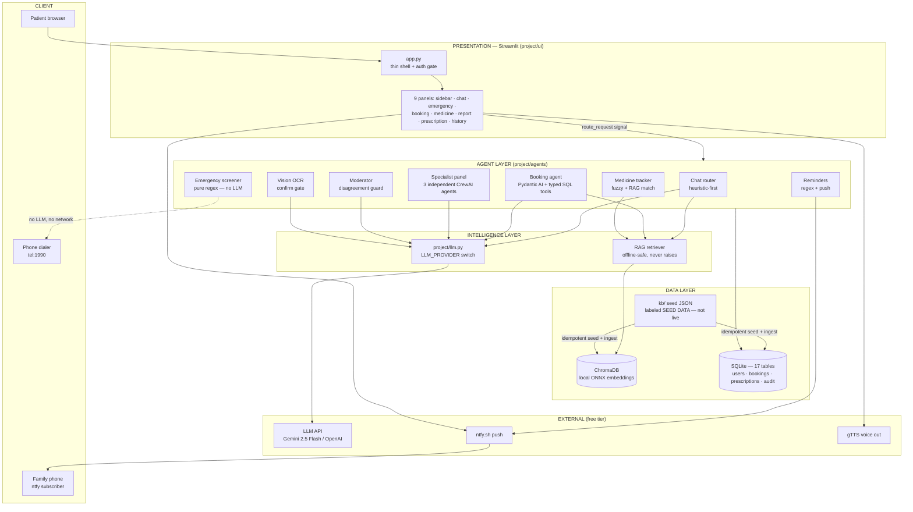
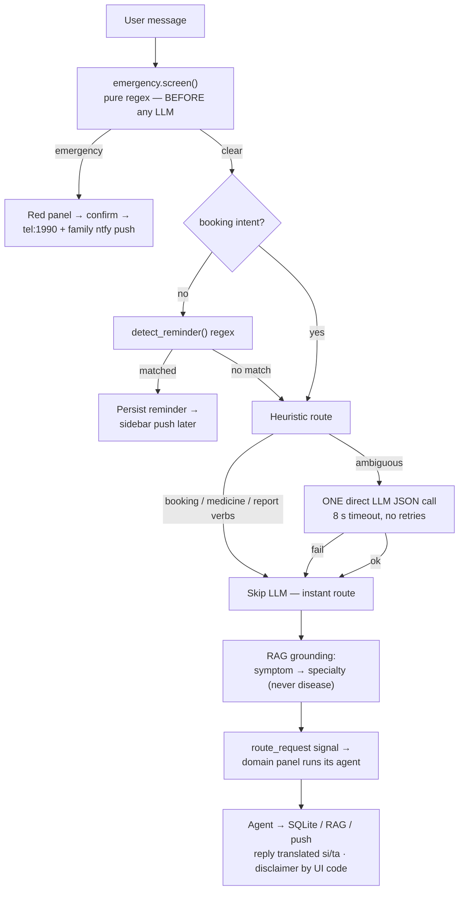

# MedBridge AI — System Architecture

Two diagrams: the **six-layer system view** and the **lifecycle of one chat turn**.
Renders in VS Code (Mermaid extension) and on GitHub. A browser-viewable copy is
[architecture.html](architecture.html); export: `npx -y @mermaid-js/mermaid-cli -i docs/architecture.md -o docs/architecture.png`.

## 1. Six-layer system view

**Layer responsibilities**

| Layer | Responsibility |
|---|---|
| Client | Browser UI, family ntfy subscriber, emergency dialer |
| Presentation | Thin shell + panels; panels talk only via `st.session_state` signals (`route_request`) |
| Agent | Domain logic, typed Pydantic contracts, deterministic offline fallback per agent |
| Intelligence | One provider layer for every LLM call (`LLM_PROVIDER`); RAG retrieval grounding |
| Data | SQLite system-of-record + Chroma vectors + labeled seed catalog |
| External | Free-tier LLM API, push notifications, TTS |

## 2. One chat turn (request lifecycle)

**Three principles to say out loud while pointing at this:**
1. **Emergency first** — the safety path is 32 compiled regexes, ~32 µs per message, synchronous, zero network, zero API cost (~100,000× cheaper than the LLM call it guards — that's why it runs on every message).
2. **Heuristic before LLM** — unambiguous intents never wait on a model; the LLM is reserved for genuinely ambiguous turns and fails fast to the heuristic.
3. **Structural safety** — disclaimers, confirm gates, and atomic booking are enforced by code, not by prompts.
